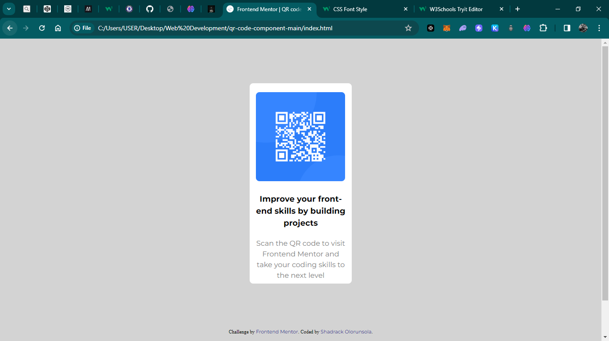

# Frontend Mentor - QR code component solution

This is a solution to the [QR code component challenge on Frontend Mentor](https://www.frontendmentor.io/challenges/qr-code-component-iux_sIO_H). Frontend Mentor challenges help you improve your coding skills by building realistic projects. 

## Table of contents

- [Overview](#overview)
  - [Screenshot](#screenshot)
  - [Links](#links)
- [My process](#my-process)
  - [Built with](#built-with)
  - [What I learned](#what-i-learned)
  - [Continued development](#continued-development)
- [Author](#author)


## Overview
This is a submittion for the completion of qrcode component on front end mentor

### Screenshot




### Links

- Solution URL: [Solution url](file:///C:/Users/USER/Desktop/Web%20Development/qr-code-component-main/index.html)
- Live Site URL: [Live site URL here](https://your-live-site-url.com)

## My process
I created a new div and added 2 paragraphs for the statements, then I choose the font family and size I wante
I added the image to the div
I chose the desirable size for the image
I fitted the div to a desirable size 
Re editted the font colors and sizes
Added background colors
Added and edited the chaalenge by and coded by section
I used hover to edit it to change colors when clicked 
### Built with

- Semantic HTML5 markup
- CSS custom properties
- [W3schools] (https://w3schools.com)


### What I learned

Use this section to recap over some of your major learnings while working through this project. Writing these out and providing code samples of areas you want to highlight is a great way to reinforce your own knowledge.

To see how you can add code snippets, see below:

```html
<div class="outsider">
  
  <p class="P-1">Improve your front-end skills by building projects</p>

  <p class="P-2">Scan the QR code to visit Frontend Mentor and take your coding skills to the next level</p>
</div> 
```
```css
.proud-of-this-css {
  :hover
}


## Author

- Website - [Olorunsola Shadrack](https://github.com/vivaskeng)
- Frontend Mentor - [@vivaskeng](https://www.frontendmentor.io/profile/vivaskeng)
- Twitter - [@oranmiyan_](https://twitter.com/oranmiyan_)


